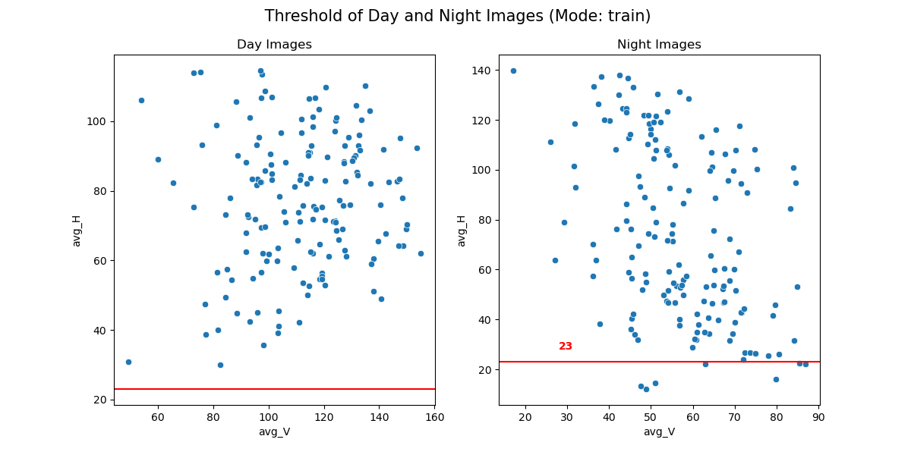
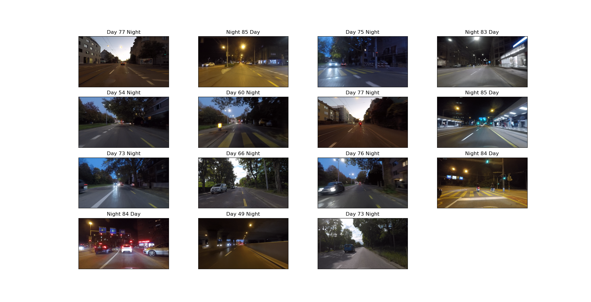
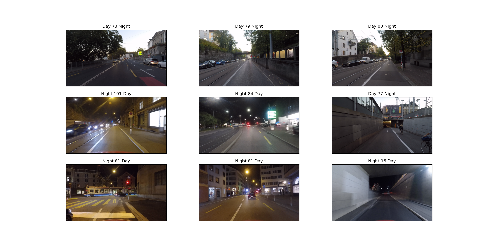
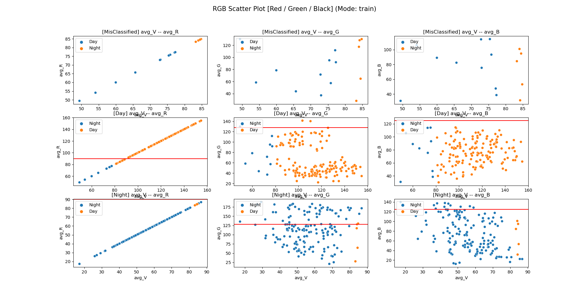
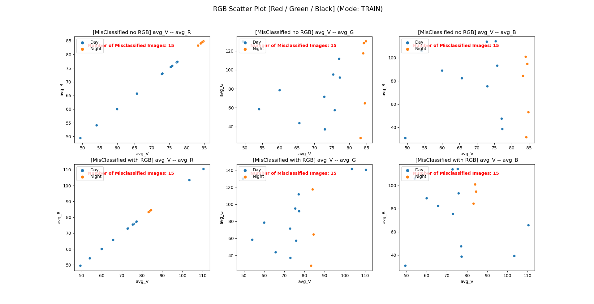
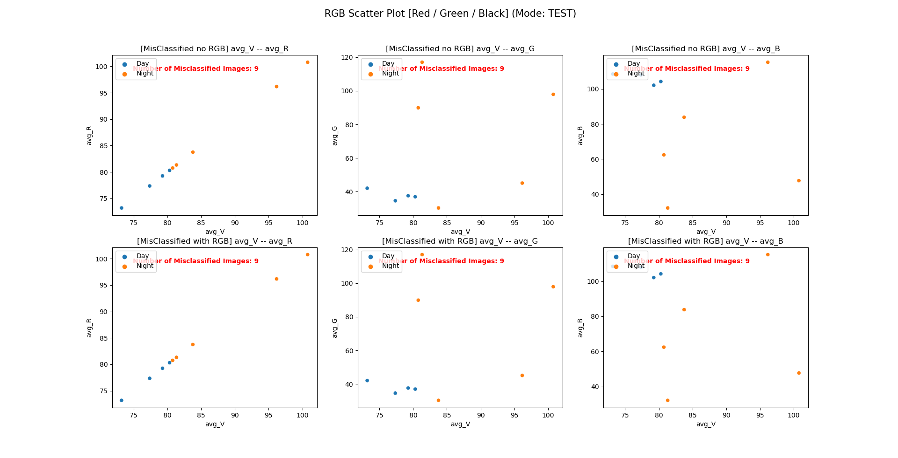

# Weather-Classifier

This repo contains code and models trained to classify images, which contains daytime, night, kinds of weather such as snows, rains, sunny, etc.

### Requirements
- [numpy](https://pypi.org/project/numpy/)
- [matplotlib](https://pypi.org/project/matplotlib/)
- [OpenCV 3](https://pypi.org/project/opencv-python/3.4.9.31/)
- [Pytorch](https://pytorch.org/get-started/locally/)
- [torchvision](https://pytorch.org/get-started/locally/)
- [seaborn](https://seaborn.pydata.org/index.html)

### Dataset
The data for this project was from [ACDC](https://acdc.vision.ee.ethz.ch/download) using the [rgb_anon_trainvaltest](https://acdc.vision.ee.ethz.ch/rgb_anon_trainvaltest.zip) datasets.

But the size of the official data is large, you can download the sample data corresponding to the code with this link [sample data](https://drive.google.com/drive/folders/1q3L_LKobZAN0AFXLtfnnlAsLMQhkZEBG?usp=sharing). (Just as an example, to check the how the code runs)

There are 4006 8-bit RGB images about Anonymized adverse-condition images for train, val and test sets, and simultaneously 4006 images corresponding anonymized normal-condition images.

### Models

Two different approaches have been used.

- Baseline model - Basic model that uses average brightness from Value channel of HSV image as threshold, with 3 filters from Hue Channel of HSV, R Channel and G Channel of RGB,  to classify images. <br/>Achieves an accuracy of 98.56\% on the validation set and 94.40\% on test set.
- Simple CNN - A Simple 5-layer Fully Convolutional Neural Network, that works on Value channel of HSV image. <br/>Achieves an accuracy of 100\% on the validation set.

### Files

#### Night / Day Classification

##### 1. Training

- [night_baseline.ipynb](./Night/Training/night_baseline.ipynb) - Training of baseline model according to brightness.
- [night_cnn.ipynb](./Night/Training/night_cnn.ipynb) - Training of Simple 5-layer CNN model
- [night_baseline.py](./Night/Training/night_baseline.py) - Perform baseline prediction on image using HSV and RGB thresholds.

##### 2. Utilis

- [DataLoader.py](./Night/utils/day_night/DataLoader.py) - Load the images, combine path, HSV and RGB value of each image as a dataframe.
- [Estimation.py](./Night/utils/day_night/Estimation.py) - Find the best Value, Hue, Red and Green threshold, as well as the maximal accuracy.
- [Visualization.py](./Night/utils/day_night/Visualization.py) - Visualize the images with the V, H, R, G channel value, scatter plots or real images.

#### Syntax for inference

```bash
git clone git@github.com:LonelVino/Weather_classification.git
cd Weather_classification/Night/Training
python3 night_baseline.py
```

#### Threshold Rules

| True Label | Predict Label | Condition (Feature) | Correct |
| ---------- | ------------- | ------------------- | ------- |
| Night      | Day           | H < H_Threshold     | Night   |
| Day        | Night         | R > R_Threshold     | Day     |
| Night      | Day           | G > G_Threshold     | Night   |

#### Sample Results

| Threshold | Train Accuracy | Validation Accuracy | Test Accuracy |
| --------- | -------------- | ------------------- | ------------- |
| *V*       | 92.50\%        | 97.64\%             | 89.60\%       |
| *V+H*     | 94.00\%        | 98.56\%             | 92.00\%       |
| *V+H+R+G* | 95.38\%        | 98.56\%             | 94.40\%       |

Where, {V,H} mean Value and Hue Channels of HSV, and {R,G} mean Red and Green Channels of RGB.

| Threshold          | *V* Channel | *H* Channel | *R* Channel | *G* Channel |
| ------------------ | ----------- | ----------- | ----------- | ----------- |
| **Train Set**      | 80.70       | 23.00       | 90          | 128         |
| **Validation Set** | 79.00       | 27.00       | 90          | 110         |
| **Test Set**       | 80.70       | 23.00       | 90          | 128         |


<p float="left">
  <center><b>The H channel Threshold of train set</b></center>
  
</p>

The best H Channel threshold of train set is **23**, as shown above, which means the images with H channel value lower than **23**, in all likelihood, are “**Night Images**”.

<p float="left">
   	<center><b>The misclassified images in train set with H threshold filter</b></center>
    
    <center style='margin-top:2em'><b>The misclassified images in test set with H threshold filter</b></center>
    
</p>

As we can see, there’re lots of **large shadow** in misclassified day images and many **artificial yellow lights** in misclassfied night images.  


<p float="left">
  <center><b>The R and G channel Thresholds of train set</b></center>
  
</p>

The first row represents the misclassified images, the second row represents the day images, the last row represents the night images.

The channels are R, G and B channel from the left column to the right column.

 <p float="left">
   	<center><b>The misclassified images in train set with R and G threshold filter</b></center>
    
    <center style='margin-top:2em'><b>The misclassified images in test set with R and G threshold filter</b></center>
    
</p>
